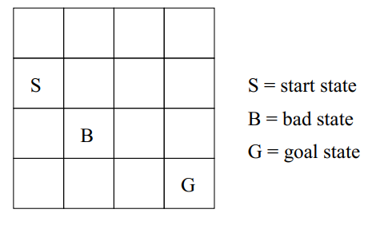

# reinforcement_learning_under-construction

( **CODE TO BE UPLOADED ON 21/5** )

In this repo we consider the following grid-world problem :

An agent starting in the start state S must reach the goal state G. At each time step, the agent can go up, down,
left or right. However, the agent’s movements are a bit noisy since it goes in the intended direction with a high
probability a and in one of the two lateral directions with a low probability b. For instance, when executing the action
up, the agent will indeed go up by one square with probability a, but may go left with probability b and right with
probability b (here a + b + b = 1). Similarly, when executing the action left, the agent will indeed go left with
probability a, but may go up with probability b and down with probability b, When an action takes the agent out of
the grid world, the agent simply bounces off the wall and stays in its current location. For example, when the agent
executes left in the start state it stays in the start state with probability a, it goes up with probability b and down
with probability b. Similarly, when the agent executes up from the start state, it goes up with probability a, right with
probability b and stays in the start state with probability b. Finally, when the agent is in the goal state, the task is over
and the agent transitions to a special end state with probability 1 (for any action). This end state is absorbing, meaning
that the agent cannot get out of the end state (i.e., it stays in the end state with probability 1 for every action).
The agent receives a reward of 100 when it reaches the goal state, -70 for the bad state and -1 for every other state,
except the end state, which has a 0 reward. The agent’s task is to find a policy to reach the goal state as quickly as
possible, while avoiding the bad state.

**task 1** : We compute the optimal policy by imlpementing the **value iteration** algorithm .

**task 2** : We assume that the transition and reward models are unknown and 
              
             compute the optimal policy by implementing the **Q-learning** algorithm.
